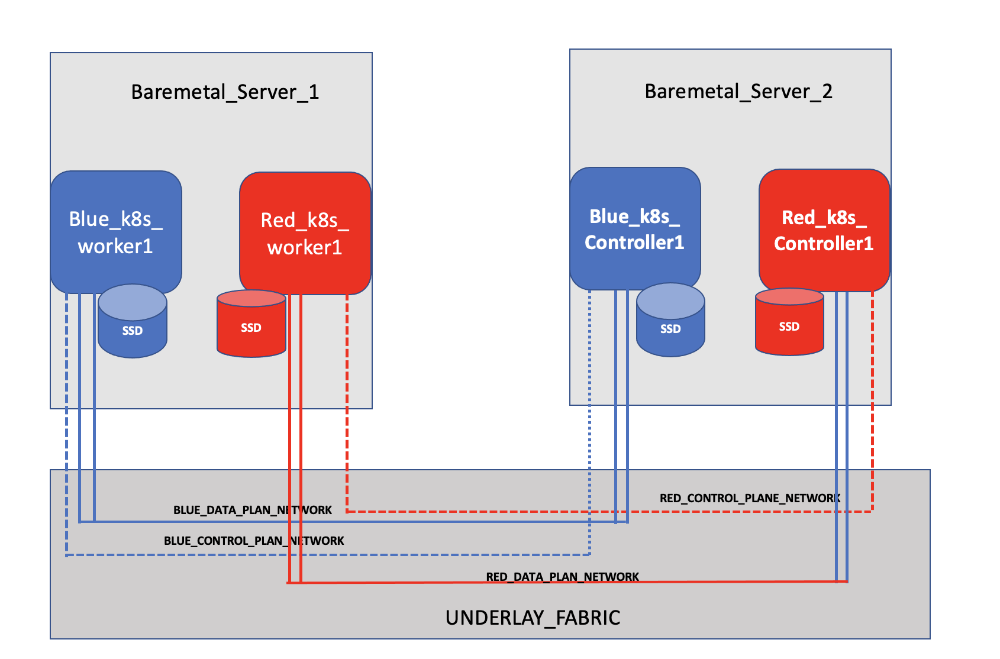

# CNF Over BMS and Infrastructure Slicing
 * Text book definition for 5G slicing is that "5G network slicing is a network architecture that enables the multiplexing of virtualized and independent logical networks on the same physical network infrastructure. Each network slice is an isolated end-to-end network tailored to fulfil diverse requirements requested by a particular application" 
 ## Problem Statment 
 * How network slicing can be achieved in NFVI (Network Function Virtulization Infrastrutre).
    - NFVI slicing is easier to achieve once Containerized Network Function (CNF)  PODs are running over the Infrastructure as a Service vitual machines (VMs). 
    - There is strong advocacy from a school of thought that CNF PODs should run on bare metal servers (BMS). 
    - Running CNF PODs over BMS can solve issues related to performance overhead  and networking  complexities can also be avoided  which are inherited when CNI has to run POD networks inside the IaaS VMs.
* If CNF Pods have to be run on BMS then it means one BMS will be used as single k8s worker node which is clearly underutilization of compute resource.
## Use cases for Running CNF over BMS
 * In 5G Cloud-RAN DU (distribuation unit) is deployed near to RU (Radio Unit) as low latency is required for DU. 
   - Cloud-native DU workloads requires low latencey thus requires BMS based K8s deployment.
   - Using a BMS; only to host single k8s node is clearly  under-utilization of compute resources.
 * In 5G Cloud-RAN CU (Central unit) is deployed far away from Radio Unit (RU) abd can bare some latency, but it is still desirable to keep the latency to minimum effect. 
 * In 5G Core Control plane sites; compute resources are usually shared to run following applications.
   - Policy Contol Function  
   - Packet Core Controller
   - IMS control plane components 
 * In 5G Core user plane sites; compute resources are usually shared to run following applications. 
   - Packet Core Gateway (5G Core User plane)
   - IMS transport and bearer services (user plane)
   - DNS services  
 * All of above  described use cases requires that CNF Pods should get performance as those are running over BMS, but compute resources should not be underutilised by dedicating the one BMS to a single K8s worker node.
    - Above implies that we need slicing of compute resources while still offering bare metal performance to CNF Pods.  
  ## Proposed Model - BMS Slicing using Hardware Pass-through technology from Bare Metal to the Guest VMs
 *  BMS slicing means avoiding  Qemu emulation of CPUs for Guest VMs (k8s worker nodes) and extending network devices either as PCI-Passthrough or SRIOV VF. 
 *  If k8s is deployed on BMS sliced infrastructure, then following problems would be resolved:-
    - No more under-utilization of compute infrastrcutre as one BMS is not limited to host one k8s worker node.
    - Same  level of performance as if k8s worker nodes is deployed over BMS or inside Guest VMs which is sliced from BMS.
    - No networking complexities, which are inherent if k8s worker nodes have to be deployed over IaaS VMs.
 * 
 
 * Slice your bare metal server (get requirements for VM/ VMs CPU, Memory and required NICs).
    - Define the VM / VMs on your bare metal server (without running the VM).
    - Define number of CPUs, map the vCPUs to Host (bare metal) CPUs.
    - While defining the vCPUs, use the  "host-pass-through" CPU model".
    - Add vCPUs for Emulator threads and IOThreads. 
    - Identitfy the NICs (PCI) on bare metal servers which should be passthrough to VMs.
    - Detach the NIC (PCI) from the Host (bare metal) and attach it to the Guest VMs. 
    - Isolate the CPUs Cores allocated to VMs, IOThreads and Emulator Threads from the Host (bare metal) OS.
    - This model will ensure that  bare metal performance can be achieved for CNF PODS running inside the VMs and network complexities are also reduced.
## Implmentation Details 
* Most of above described requirements can be achieved via IaaS (Open stack, but I will not discuss that).
* I will discuss implementation details for Host OS (Ubunut 18.04) and Guest VMs Running (Centos 18.06).
    - Identify the NUMA Archticture 
```
server1:~$ lscpu
Architecture:        x86_64
CPU op-mode(s):      32-bit, 64-bit
Byte Order:          Little Endian
CPU(s):              24
On-line CPU(s) list: 0-23
Thread(s) per core:  2
Core(s) per socket:  6
Socket(s):           2
NUMA node(s):        2
Vendor ID:           GenuineIntel
CPU family:          6
Model:               62
Model name:          Intel(R) Xeon(R) CPU E5-2620 v2 @ 2.10GHz
Stepping:            4
CPU MHz:             1200.529
CPU max MHz:         2600.0000
CPU min MHz:         1200.0000
BogoMIPS:            4199.96
Virtualization:      VT-x
L1d cache:           32K
L1i cache:           32K
L2 cache:            256K
L3 cache:            15360K
NUMA node0 CPU(s):   0,2,4,6,8,10,12,14,16,18,20,22
NUMA node1 CPU(s):   1,3,5,7,9,11,13,15,17,19,21,23

server1:~$ sudo cat $(find /sys/devices/system/cpu -regex ".*cpu[0-9]+/topology/thread_siblings_list") | sort -n | uniq
0,12
1,13
2,14
3,15
4,16
5,17
6,18
7,19
8,20
9,21
10,22
11,23
```
* I have 2 socket machine each with 6 physical cores and enabling hyperthreading gave me 12 cores on each socket, but each CPU sibling will be dedicated to the purpose for which main core will be used.  
- Host OS CPU Cores
```
0,12
1,13
```
- Guest VM - Red_k8s_cluster_worker1
```
2,14 Phyical CPUs mapped to Emultaor threads and IOThreads

4,16 Physical CPUs Mapped to Guest VM vCPUs
6,18
8,20
10,22
```
- Guest VM - Red_k8s_cluster_worker1
```
3,15 Phyical CPUs mapped to Emultaor threads and IOThreads

5,17 Physical CPUs Mapped to Guest VM vCPUs
7,19
9,21
11,23
```
* Isolate the CPUs so that host OS shcduler should not use CPUs dedciated for Guest VMs, Emulator Threads and Guest IOThread.
* Enable pci-pass-through and CPU Isolation in Grub config.

```
vim /etc/default/grub
GRUB_CMDLINE_LINUX="intel_iommu=on isolcpus=2-11,14-23"
update-grub
shutdown -r now 
```

* Verify if the IOMMU is enabled or not

```
root@server1:/tmp# dmesg | grep IOMMU
[    0.000000] DMAR: IOMMU enabled
[    0.000000] DMAR-IR: IOAPIC id 2 under DRHD base  0xd0100000 IOMMU 0
[    0.000000] DMAR-IR: IOAPIC id 0 under DRHD base  0xdc100000 IOMMU 1
[    0.000000] DMAR-IR: IOAPIC id 1 under DRHD base  0xdc100000 IOMMU 1
```
* Identify the NICs which will be passed through to the Guest VMs.

```
sudo lshw -c network -businfo
Bus info          Device      Class          Description
========================================================
pci@0000:01:00.0  eno1        network        Ethernet Controller 10-Gigabit X540-AT2
pci@0000:01:00.1  eno2        network        Ethernet Controller 10-Gigabit X540-AT2
pci@0000:08:00.0  eno3        network        I350 Gigabit Network Connection
pci@0000:08:00.1  eno4        network        I350 Gigabit Network Connection
                  virbr0      network        Ethernet interface
```
* I will utilze eno1 and eno2 as PCI passthrough devices. 

```
virsh nodedev-dumpxml pci_0000_01_00_0
<device>
  <name>pci_0000_01_00_0</name>
  <path>/sys/devices/pci0000:00/0000:00:01.0/0000:01:00.0</path>
  <parent>pci_0000_00_01_0</parent>
  <driver>
    <name>vfio-pci</name>
  </driver>
  <capability type='pci'>
    <domain>0</domain>
    <bus>1</bus>
    <slot>0</slot>
    <function>0</function>
    <product id='0x1528'>Ethernet Controller 10-Gigabit X540-AT2</product>
    <vendor id='0x8086'>Intel Corporation</vendor>
    <capability type='virt_functions' maxCount='63'/>
    <iommuGroup number='25'>
      <address domain='0x0000' bus='0x01' slot='0x00' function='0x0'/>
    </iommuGroup>
    <numa node='0'/>
    <pci-express>
      <link validity='cap' port='0' speed='5' width='8'/>
      <link validity='sta' speed='5' width='8'/>
    </pci-express>
  </capability>
</device>

virsh nodedev-dumpxml pci_0000_01_00_1
<device>
  <name>pci_0000_01_00_1</name>
  <path>/sys/devices/pci0000:00/0000:00:01.0/0000:01:00.1</path>
  <parent>pci_0000_00_01_0</parent>
  <driver>
    <name>vfio-pci</name>
  </driver>
  <capability type='pci'>
    <domain>0</domain>
    <bus>1</bus>
    <slot>0</slot>
    <function>1</function>
    <product id='0x1528'>Ethernet Controller 10-Gigabit X540-AT2</product>
    <vendor id='0x8086'>Intel Corporation</vendor>
    <capability type='virt_functions' maxCount='63'/>
    <iommuGroup number='26'>
      <address domain='0x0000' bus='0x01' slot='0x00' function='0x1'/>
    </iommuGroup>
    <numa node='0'/>
    <pci-express>
      <link validity='cap' port='0' speed='5' width='8'/>
      <link validity='sta' speed='5' width='8'/>
    </pci-express>
  </capability>
</device>
```
* Detach the selected PCI Devices from Host OS (Bare Metal Server)

```
virsh nodedev-detach pci_0000_01_00_0
virsh nodedev-detach pci_0000_01_00_1
lshw -c network -businfo
Bus info          Device      Class          Description
========================================================
pci@0000:01:00.0              network        Ethernet Controller 10-Gigabit X540-AT2
pci@0000:01:00.1              network        Ethernet Controller 10-Gigabit X540-AT2
pci@0000:08:00.0  eno3        network        I350 Gigabit Network Connection
pci@0000:08:00.1  eno4        network        I350 Gigabit Network Connection
                  virbr0      network        Ethernet interface
                  virbr0-nic  network        Ethernet interface
```
* Create Guest VMs Defination Files 
 - Red_k8s_cluster_worker1 VM
```
node_name=Red_k8s_cluster_worker1
export LIBGUESTFS_BACKEND=direct
root_password=root-password
someuser_password=someuser-password
cloud_image=/var/lib/libvirt/images/CentOS-7-x86_64-GenericCloud-1811.qcow2

qemu-img create -f qcow2 /var/lib/libvirt/images/${node_name}.qcow2 100G

virt-resize --expand /dev/sda1 ${cloud_image} /var/lib/libvirt/images/${node_name}.qcow2 && virt-customize  -a /var/lib/libvirt/images/${node_name}.qcow2   --run-command 'xfs_growfs /' --selinux-relabel

virt-customize  -a /var/lib/libvirt/images/${node_name}.qcow2   --run-command 'xfs_growfs /'  --root-password password:${root_password}   --hostname ${node_name}.${nodesuffix}   --run-command 'useradd someuser'   --password someuser:password:${someuser_password}   --run-command 'echo "someuser ALL=(root) NOPASSWD:ALL" | tee -a /etc/sudoers.d/someuser'   --chmod 0440:/etc/sudoers.d/someuser   --run-command 'sed -i "s/PasswordAuthentication no/PasswordAuthentication yes/g" /etc/ssh/sshd_config'   --run-command 'systemctl enable sshd'   --run-command 'yum remove -y cloud-init'   --selinux-relabel


virt-install --name ${node_name} \
  --virt-type kvm --memory 8192  --vcpus 8 \
  --boot hd,menu=on \
  --disk path=/var/lib/libvirt/images/${node_name}.qcow2,device=disk \
  --graphics vnc \
  --cpu host-passthrough \
  --os-type=Linux \
  --os-variant=centos7.0 \
  --host-device=pci_0000_01_00_0 \
  --console pty,target_type=serial \
  --dry-run --print-xml > /tmp/${node_name}.xml
```
- Blue_k8s_cluster_worker1 VM
```
node_name=Blue_k8s_cluster_worker1
export LIBGUESTFS_BACKEND=direct
root_password=root-password
someuser_password=someuser-password
cloud_image=/var/lib/libvirt/images/CentOS-7-x86_64-GenericCloud-1811.qcow2

qemu-img create -f qcow2 /var/lib/libvirt/images/${node_name}.qcow2 100G

virt-resize --expand /dev/sda1 ${cloud_image} /var/lib/libvirt/images/${node_name}.qcow2 && virt-customize  -a /var/lib/libvirt/images/${node_name}.qcow2   --run-command 'xfs_growfs /' --selinux-relabel

virt-customize  -a /var/lib/libvirt/images/${node_name}.qcow2   --run-command 'xfs_growfs /'  --root-password password:${root_password}   --hostname ${node_name}.${nodesuffix}   --run-command 'useradd someuser'   --password someuser:password:${someuser_password}   --run-command 'echo "someuser ALL=(root) NOPASSWD:ALL" | tee -a /etc/sudoers.d/someuser'   --chmod 0440:/etc/sudoers.d/someuser   --run-command 'sed -i "s/PasswordAuthentication no/PasswordAuthentication yes/g" /etc/ssh/sshd_config'   --run-command 'systemctl enable sshd'   --run-command 'yum remove -y cloud-init'   --selinux-relabel

virt-install --name ${node_name} \
  --virt-type kvm --memory 8192  --vcpus 8 \
  --boot hd,menu=on \
  --disk path=/var/lib/libvirt/images/${node_name}.qcow2,device=disk \
  --graphics vnc \
  --cpu host-passthrough \
  --os-type=Linux \
  --os-variant=centos7.0 \
  --host-device=pci_0000_01_00_1 \
  --console pty,target_type=serial \
  --dry-run --print-xml > /tmp/${node_name}.xml
```

* Edit the Guest VM Defination Files  
- Repeat it for both/ all of the guest VMs 
```
vim /tmp/Red_k8s_cluster_worker1.xml
```
- Remove following line 
```
<vcpu>8</vcpu>
```
- Add following line 
``` 
 <vcpu placement='static'>8</vcpu>
```
- Add following lines 
```
 <iothreads>1</iothreads>
 <cputune>
    <vcpupin vcpu='0' cpuset='4'/>
    <vcpupin vcpu='1' cpuset='6'/>
    <vcpupin vcpu='2' cpuset='8'/>
    <vcpupin vcpu='3' cpuset='10'/>
    <vcpupin vcpu='4' cpuset='16'/>
    <vcpupin vcpu='5' cpuset='18'/>
    <vcpupin vcpu='6' cpuset='20'/>
    <vcpupin vcpu='7' cpuset='22'/>
    <emulatorpin cpuset='2,14'/>
    <iothreadpin iothread='1' cpuset='2,14'/>
 </cputune>
```
- Remove following lines
```
  <interface type="network">
      <source network="default"/>
      <mac address="52:54:00:13:c2:8e"/>
      <model type="virtio"/>
  </interface>
```
- Ensure network devices is added as PCI-Pass-through
```
<hostdev mode="subsystem" type="pci" managed="yes">
      <source>
        <address domain="0" bus="1" slot="0" function="0"/>
      </source>
 </hostdev>
```
* Define Guest VMs 

```
virsh define /tmp/Red_k8s_cluster_worker1.xml
virsh define /tmp/Blue_k8s_cluster_worker1.xml
```
* Start the Guest VMs

```
virsh start Red_k8s_cluster_worker1
virsh start Blue_k8s_cluster_worker1
```
## Verfication
* Verify the Network Connectivty between Guest VMs and Underlay_Fabric_Switch.
- Underlay_Fabric_Switch ports must be configured with correct VLAN on interfaces connected with (bare metal NICs which are  passed through to the Guest VMs).
- Once correct config will be applied on Guest VM NICs then connectivty towards fabric and other VMs on same subnet should be established.
```
 fabric-switch> show ethernet-switching table | match bc:30:5b:f2:87:52
  Red_Tenant_Network    bc:30:5b:f2:87:52 Learn          0 ge-0/0/9.0

fabric-switch> show ethernet-switching table interface ge-0/0/8
Ethernet-switching table: 1 unicast entries
  VLAN	            MAC address       Type         Age Interfaces

 Blue_Tenant_Network      bc:30:5b:f2:87:50 Learn       4:17 ge-0/0/8.0
```
* Verify CPU Allocation
- CPU Allocation Design 
```
Red_k8s_cluster_worker1 VM 
2,14 (Emultaor threads and IOThreads)

4,16 mapped to Guest VM vCPUs
6,18
8,20
10,22

Blue_k8s_cluster_worker1 VM
3,15 (Emultaor threads and IOThreads)
5,17 Mapped to Guest VM vCPUs
7,19
9,21
11,23
```
* Output Collected from the Host OS 
```
server1:/tmp# virsh vcpuinfo Red_k8s_cluster_worker1
VCPU:           0
CPU:            4
State:          running
CPU time:       28.3s
CPU Affinity:   ----y-------------------

VCPU:           1
CPU:            6
State:          running
CPU time:       24.6s
CPU Affinity:   ------y-----------------

VCPU:           2
CPU:            8
State:          running
CPU time:       13.9s
CPU Affinity:   --------y---------------

VCPU:           3
CPU:            10
State:          running
CPU time:       17.8s
CPU Affinity:   ----------y-------------

VCPU:           4
CPU:            16
State:          running
CPU time:       10.2s
CPU Affinity:   ----------------y-------

VCPU:           5
CPU:            18
State:          running
CPU time:       9.8s
CPU Affinity:   ------------------y-----

VCPU:           6
CPU:            20
State:          running
CPU time:       9.4s
CPU Affinity:   ---------------------y--

VCPU:           7
CPU:            22
State:          running
CPU time:       7.4s
CPU Affinity:   -----------------------y


server1:/tmp# virsh emulatorpin Red_k8s_cluster_worker1
emulator: CPU Affinity
----------------------------------
       *: 2,14


server1:~$ virsh vcpuinfo Blue_k8s_cluster_worker1
VCPU:           0
CPU:            5
State:          running
CPU time:       25.4s
CPU Affinity:   -----y------------------

VCPU:           1
CPU:            7
State:          running
CPU time:       11.8s
CPU Affinity:   -------y----------------

VCPU:           2
CPU:            9
State:          running
CPU time:       9.9s
CPU Affinity:   ---------y--------------

VCPU:           3
CPU:            11
State:          running
CPU time:       15.5s
CPU Affinity:   -----------y------------

VCPU:           4
CPU:            17
State:          running
CPU time:       18.9s
CPU Affinity:   -----------------y------

VCPU:           5
CPU:            19
State:          running
CPU time:       8.8s
CPU Affinity:   -------------------y----

VCPU:           6
CPU:            21
State:          running
CPU time:       9.4s
CPU Affinity:   ---------------------y--

VCPU:           7
CPU:            23
State:          running
CPU time:       7.4s
CPU Affinity:   -----------------------y


server1:~$ virsh emulatorpin Blue_k8s_cluster_worker1

emulator: CPU Affinity
----------------------------------
       *: 3,15
```

## Seprate Network for Control and Data Plane

* In above discussion I have used single network inside K8s worker nodes for Red and Blue cluster.
* If multiple network interfaces are required for each worker node for each K8s cluster, then extend it to the Guest VMs accordingly.

## Sriov Vs PCI-Passthrough
* SRIOV VFs can  be passed to the Guest VFs instead of PCI Passthrough.
* Upside for using SRIOV VFs is that with fewer physical NICs we can provide direct connetvity to the Guest VM (avoiding virtio drivers).
* Downside of SRIOV VFs is that some of the physical network functionality may not be available over the VFs (e.g. LACP or 802.3 ad bond can't be configured over SRIOV VFs).
* Upside of of PCI pass-through is that full network functionality would be available to Guest VMs NICs (e.g LACP or 802.3ad can be conigured over PCI pass through NICs).
* Downside of PIC pass-through is extra cost for having seprate PCI pass-through NICs for each NUMA node which could sufffice the Guest VM requirments. 
## Next Step
* I will scale up this infrastrcure to 4 bare metal servers (1 Control host and 3 Worker nodes) to run 2 K8s clusters (Red and Blue)  while running Juniper Networks Cloud Native CN2 as CNI for those K8s Clusters.
## Conclusion
* We can run multiple k8s cluster in same infrastruture and Guest VMs (k8s worker nodes) will get bare metal like peformance because of following factors:-
  - Avoiding the virtio drivers and Qemu Emulation for CPUs (because of Hostpass-through CPU model) and NIC cards (because of PCI pass-through).
  - Having dedicated IOthread cores will offer speedy read/write operations to the disk.
  - Dedicated emulator threads will ensure that all qemu related tasks for guest VMs will be handled by those dedicated cores. 
  - Isolating CPU Cores dedicated for Guest VMs, IOThreads and  Emulator threads from Host OS CPU cores will ensure that the Host OS scheduler is not overlapping with Guest VMs resources.  